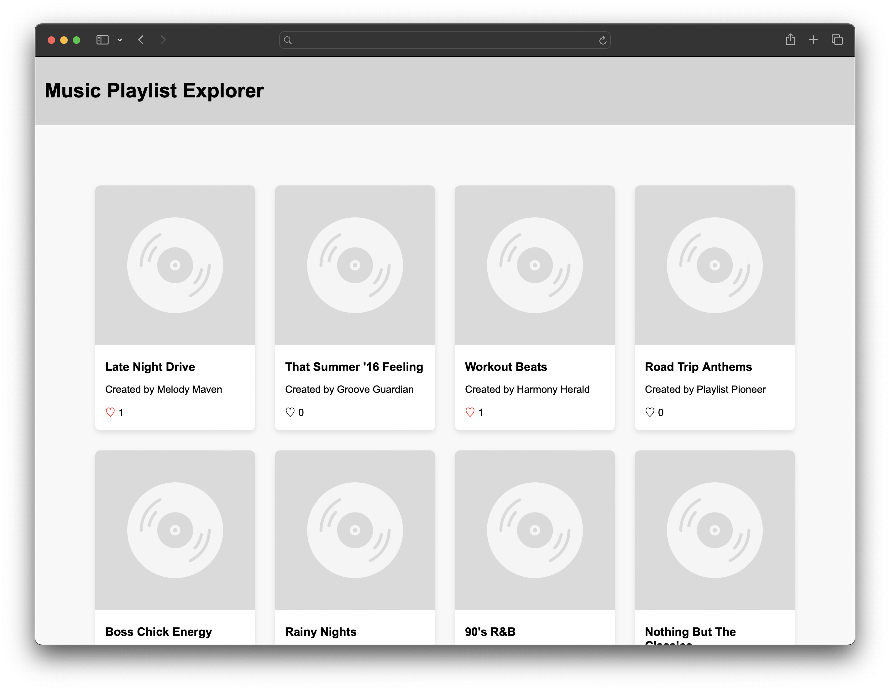
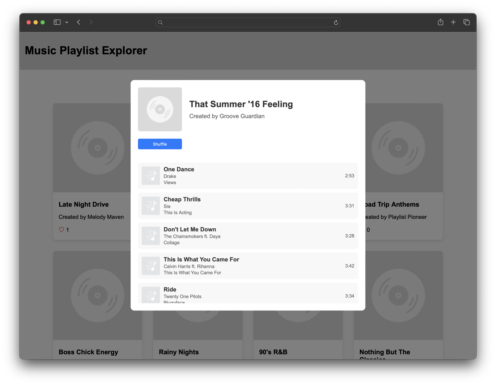

## Project #2: Music Playlist Explorer

### Overview

In the "Music Playlist Explorer" project, you will develop a web application that enables users to browse a curated selection of music playlists. The site features a clean, user-friendly interface where playlists are displayed as interactive tiles. Users can like playlists or click on a tile to open a modal with detailed information, including a list of songs. Within the modal view, users can shuffle the order of songs for a fresh listening experience.

### 🎯 Goals

By the end of this assignment, you will be able to:

- [ ] Write HTML and apply CSS styling to create a clean and user-friendly interface for the application.
- [ ] Dynamically render music playlists on a web page using JavaScript and data from a JSON file.
- [ ] Create and manipulate modal views to display detailed information about each playlist.
- [ ] Implement interactive features such as liking playlists and shuffling songs within a playlist.

### Required Features

- [ ] **Display Playlists**: Dynamically render playlists on the homepage using JavaScript. Fetch data from a provided JSON file and use it to create interactive playlist tiles that display the playlist's cover image, name, creator, and like count.

- [ ] **Playlist Details**: Create a modal view that displays detailed information about a playlist when a user clicks on a playlist tile. The modal should show the playlist's cover image, name, creator, and a list of songs, including their titles, artists, and durations.

- [ ] **Like Playlists**: Implement functionality to allow users to like playlists by clicking a heart icon on each playlist tile. Update the like count on the playlist tile when a playlist is liked or unliked, providing immediate visual feedback to the user.

- [ ] **Shuffle Songs**: Enable users to shuffle the songs within a playlist using a shuffle button in the playlist detail modal. Rearrange the songs in the modal view when the shuffle button is clicked, providing immediate visual feedback to the user.

#### Screenshots

A simple version of the app with all the required features implemented:

:::success




<center><video width="450" height="450" controls>
  <source src="./project_2/shuffle.mp4" type="video/mp4">
</video></center>

:::

### Project Instructions

<details>
<summary style="font-size:1.2em; font-weight: 600">Milestone 0: Project Setup</summary>

## Goal

The goal for this milestone is to cover all the setup needed at the beginning of this project, which includes:

1. Creating the project structure
2. Setting up the HTML, CSS, and JavaScript files
3. Loading the starter data from a JSON file

## Requirements

### Create Project Structure

1. Create a new directory for your project, for example, `music-playlist-explorer`.
2. Inside this directory, create the following files and folders:
   - `index.html`: This will be the main HTML file for your project.
   - `style.css`: This will contain all the CSS styles for your project.
   - `script.js`: This will contain the main JavaScript code for your project.
   - `data/`: This will be a directory to store your JavaScript file containing the playlist data.

### Setting Up HTML, CSS, and JavaScript Files

1. Open your `index.html` file and set up the basic HTML structure. Link your CSS and JavaScript files by adding the following lines in the `<head>` section:

   ```html
   <link rel="stylesheet" href="style.css">
   ```

2. Add a website title and favicon to the browser tab by adding the following lines in the `<head>` section:

   ```html
   <title>Music Playlist Explorer</title>
   <link rel="icon" type="image/x-icon" href="assets/img/favicon.ico">
   ```

3. Add the following lines at the end of the `<body>` section to link your JavaScript files:

   ```html
   <script src="data/data.js"></script>
   <script src="script.js"></script>
   ```

4. Start writing your CSS styles in `style.css`.
5. Start writing your JavaScript logic in `script.js`.

### Loading Starter Data

1. Create a JavaScript file inside the `data/` directory, for example, `data.js`. This file will contain the initial data for your playlists in JSON format, assigned to a variable. For example:

   ```javascript
   let data = {
     "playlists": [
       {
         "playlistID": 1,
         "playlist_name": "Chill Vibes",
         "playlist_creator": "DJ Cool",
         "playlist_art": "path/to/image.jpg",
         "songs": [
           {
             "title": "Relaxing Song",
             "artist": "Artist Name",
             "album": "Album Title",
             "duration": "3:45",
             "cover_art": "path/to/song/image.jpg"
           },
           // More songs...
         ]
       },
       // More playlists...
     ]
   };
   ```

2. In your `script.js`, you can reference the `data` variable to access the playlist data, as it is globally available due to the order of the script tags in the HTML file.

## Running the Project

1. Open your project directory in VS Code.
2. Open the `index.html` file in a web browser to view your project.
3. As you make changes to your HTML, CSS, or JavaScript files, refresh the browser to see the updates.

</details>

<details>
<summary style="font-size:1.2em; font-weight: 600">Milestone 1: Adding Structure with HTML</summary>


## Goal

The goal of this milestone is to set up the basic structure of your web application using HTML. This includes creating the main layout, adding a sample playlist card, and setting up a modal for displaying playlist details.

## Requirements

1. **Create the Main Layout**:
   - Open your `index.html` file.
   - Set up the basic structure of your application with a header, a main section for the playlist gallery, and a footer.

    ```html
    <header>
        <div class="header-container">
            <h1>Music Playlist Explorer</h1>
        </div>
    </header>

    <main>
        <section class="playlist-gallery">
            <!-- Playlist cards will be dynamically inserted here -->
        </section>

        <!-- Modal overlay will be added here -->
    </main>

    <footer>
        <!-- Your footer content here -->
    </footer>
    ```

2. **Create Playlist Card Container**:
   - Inside the main section, create a container for the playlist cards with the class `playlist-cards`.

    ```html
    <div class="playlist-cards">
        <!-- Playlist cards will be dynamically inserted here -->
    </div>
    ```

3. **Add a Sample Playlist Card**:
   - Inside the `playlist-cards` container, add a hard-coded playlist card.
   - This card should include an image, playlist title, creator name, and like count.
   - This will serve as a template for styling and will be replaced with dynamic content in later milestones.

    ```html
    <!-- Sample Playlist Card -->
    <div class="card">
        
        <div class="card-content">
            <h3 class="playlist-title">Sample Playlist</h3>
            <p class="creator-name">Created by John Doe</p>
            <div class="card-stats">
                <span class="like-count">42 Likes</span>
            </div>
        </div>
    </div>
    <!-- End of Sample Playlist Card -->
    ```

4. **Create Modal Overlay**:
   - Outside the main section, create a modal overlay structure with the class `modal-overlay`.
   - This will be used to display the modal content.

    ```html
    <div class="modal-overlay">
        <!-- Modal content will be dynamically added and removed from here -->
    </div>
    ```

5. **Create Modal Content Container**:
   - Inside the modal overlay, create a container for the modal content with the class `modal-content`.

    ```html
    <div class="modal-content">
        <!-- Modal content will be dynamically added and removed from here -->
    </div>
    ```

6. **Add Sample Modal Content**:
   - Inside the `modal-content` container, add hard-coded content for the modal.
   - This should include a close button, playlist details, and a list of songs.
   - Initially, this modal can be hard-coded with sample data.

    ```html
    <!-- Sample Modal Content -->
    <div class="modal-header">
        
        <div class="playlist-info">
            <h3 class="playlist-title">Sample Playlist</h3>
            <p class="creator-name">Created by John Doe</p>
        </div>
    </div>
    <div class="modal-body">
        <ul>
            <li>Song 1 - Artist 1</li>
            <!-- More songs -->
        </ul>
    </div>
    <!-- End of Sample Modal Content -->
    ```

:::warning
### Checkpoint

At this point, your application should have a basic structure with a sample playlist card and a modal layout. You can now proceed to styling these elements in the next milestone.
:::

</details>

<details>
<summary style="font-size:1.2em; font-weight: 600">Milestone 2: Styling with CSS</summary>


## Goal

The goal for this milestone is to apply CSS styling to create a visually appealing and user-friendly interface for your Music Playlist Explorer application.

## Requirements

### Styling the Main Page

1. **Header and Footer**:
   - Style the header and footer of your page to differentiate them from the main content.
   - Example: Set a background color, add padding, and center the text.

2. **Playlist Cards**:
   - Style the playlist cards to make them visually distinct and appealing.
   - Example: Add borders, shadows, and hover effects.

3. **Modal Styling**:
   - Style the modal overlay and content to create a centered pop-up effect when a playlist card is clicked.
   - Example: Set the background of the overlay, style the content area, and add animations for opening the modal.

4. **Responsive Design**:
   - Ensure that your application is responsive and looks good on different screen sizes using flexbox.

:::warning
#### Checkpoint

Before moving on to the next milestone, ensure that:

- Your header and footer are styled and clearly distinguishable from the main content.
- The playlist cards have a consistent and appealing design, with visual feedback on hover.
- The modal view is styled and centered, with a clear layout for displaying playlist details.
:::

</details>

<details>
<summary style="font-size:1.2em; font-weight: 600">Milestone 3: Displaying Shared Playlists</summary>


## Goal

The goal of this milestone is to dynamically render the shared playlists on the homepage using data from the provided JSON file.

## Requirements

### Setting Up the Data

1. **Create a JSON File**:
   - Create a file named `data.js` inside the `data/` directory.
   - Define a variable `data` that contains an array of playlist objects. Each playlist should have properties such as `playlistID`, `playlist_name`, `playlist_creator`, `playlist_art`, and `songs`.

### Displaying Playlists

2. **Dynamically Create Playlist Cards**:
   - In your `script.js`, write a function that iterates over the `data.playlists` array and creates a card for each playlist.
   - Each card should display the playlist's cover image, name, creator, and like count.
   - Append the created cards to the `playlist-cards` container in your HTML.

:::warning
#### Checkpoint

Before moving on to the next milestone, ensure that:

- The `data.js` file is properly set up with the shared playlists data.
- Your application dynamically creates and displays playlist cards on the homepage based on the data from `data.js`.
- Each playlist card shows the relevant information (cover image, name, creator, like count) as specified in the JSON file.
:::

</details>

<details>
<summary style="font-size:1.2em; font-weight: 600">Milestone 4: Viewing Playlist Details</summary>


## Goal

The goal of this milestone is to allow users to view detailed information about a playlist in a modal when a playlist card is clicked.

## Requirements

### Setting Up the Modal

1. **Create a Modal Structure**:
   - In your `index.html`, create a structure for the modal overlay and modal content. The modal should initially be hidden.

2. **Styling the Modal**:
   - In your `style.css`, add styles for the modal overlay and content to create a centered pop-up effect. The modal should cover the entire viewport with a semi-transparent background.

### Displaying Playlist Details

3. **Dynamically Populate Modal Content**:
   - In your `script.js`, write a function that populates the modal with detailed information about the clicked playlist. This should include the playlist's cover image, name, creator, and a list of songs with their titles, artists, and durations.

4. **Opening and Closing the Modal**:
   - Add event listeners to each playlist card to open the modal with the corresponding playlist details when clicked.
   - Add an event listener to the modal overlay to close the modal when the overlay is clicked.

:::warning
#### Checkpoint

Before moving on to the next milestone, ensure that:

- Clicking on a playlist card opens a modal displaying detailed information about that playlist.
- The modal can be closed by clicking on the overlay outside the modal content.
- The modal displays all the required information about the playlist, including the list of songs.
:::

</details>

<details>
<summary style="font-size:1.2em; font-weight: 600">Milestone 5: Liking Playlists</summary>

## Goal

The goal of this milestone is to implement the functionality for users to like playlists by clicking a heart icon on each playlist card.

## Requirements

### Adding Like Icons

1. **Update Playlist Cards**:
   - Modify the HTML structure of each playlist card to include a heart icon for the like button.
   - You can use an emoji, an image, or a font icon library like Font Awesome for the heart icon.

2. **Styling the Like Icon**:
   - In your `style.css`, add styles for the like icon. Ensure that the icon is visually distinct and changes appearance when hovered or clicked.

#### Implementing Like Functionality

3. **JavaScript Logic for Liking**:
   - In your `script.js`, add an event listener to each like icon that increments the like count for the corresponding playlist when clicked.
   - Ensure that the like count is updated both in the data model and on the playlist card.

:::warning
#### Checkpoint

Before moving on to the next milestone, ensure that:

- Each playlist card has a like icon that users can click.
- Clicking the like icon increments the like count for that playlist.
- The updated like count is reflected on the playlist card.
:::

</details>

<details>
<summary style="font-size:1.2em; font-weight: 600">Milestone 6: Shuffling Songs</summary>

## Goal

The goal of this milestone is to add functionality to shuffle the songs within a playlist when the user clicks a shuffle button in the playlist detail modal.

## Requirements

### Adding Shuffle Button

1. **Update Playlist Modal**:
   - Modify the HTML structure of the playlist modal to include a shuffle button.
   - You can use a simple button element with the text "Shuffle" for this purpose.

2. **Styling the Shuffle Button**:
   - In your `style.css`, add styles for the shuffle button. Ensure that the button is visually distinct and changes appearance when hovered or clicked.

### Implementing Shuffle Functionality

3. **JavaScript Logic for Shuffling**:
   - In your `script.js`, add an event listener to the shuffle button that shuffles the order of songs in the playlist when clicked.
   - Ensure that the shuffled songs are updated both in the data model and in the modal view.

:::warning
#### Checkpoint

Before moving on to the next milestone, ensure that:

- Each playlist modal has a shuffle button that users can click.
- Clicking the shuffle button rearranges the order of songs in the playlist.
- The shuffled songs are displayed in the modal view.
:::

</details>


### Stretch Features

#### (Optional) Playlist Management Features

- [ ] **Add New Playlists**: Allow users to create new playlists by providing a form to input playlist details and song information.
  - Users can input playlist name, creator, and add multiple songs with details like title, artist, and duration.
- [ ] **Edit Existing Playlists**: Enable users to modify the details of existing playlists.
  - Implement an edit button on each playlist tile that opens a form pre-populated with the current playlist details, allowing users to update the name, creator, and songs.
- [ ] **Delete Playlists**: Enable users to delete playlists from the homepage.
  - Implement a delete button on each playlist tile that, when clicked, removes the playlist from the display and data model.

#### (Optional) Advanced Interactivity Features

- [ ] **Search Functionality**: Implement a search bar to allow users to filter playlists by name or creator.
  - As users type in the search bar, dynamically update the displayed playlists to only show those that match the search query.
- [ ] **Sorting Options**: Provide options for users to sort playlists by different criteria such as name, number of likes, or date added.
  - Implement dropdown or button options that reorder the displayed playlists based on the selected sorting criterion.

### 💡 Hints

<!--- Hints go here, in Q&A format -->

- Help! I don't know where to start!
  - As always, a good starting place would be to set up the XML Layout for your app.
  - Look at this weeks lab for examples on how to implement similar applications.  What code will be similar?  What do you need to change?

- I'm stuck on something!
  - Don't just skip the Resources section!
  - Still need a little extra help getting started or running into an error?  Try posting in the [Discussions](https://discussions.codepath.com/).

- How do I dynamically render playlists on the homepage?
  - Use JavaScript to iterate over the playlist data from the JSON file and create HTML elements for each playlist. Then, append these elements to the playlist container on the homepage.
  - You can use the `createElement` and `appendChild` methods in JavaScript to create and add new elements to the DOM.

- How can I update the like count when a playlist is liked?
  - Add an event listener to the like button for each playlist. When the button is clicked, increment the like count for that playlist and update the displayed count in the DOM.
  - You may need to use a variable or data attribute to keep track of the like count for each playlist.

- How do I create a modal view for playlist details?
  - Create a hidden modal element in your HTML with a structure for displaying playlist details. Use CSS to style the modal and make it appear centered and above the rest of the content.
  - Use JavaScript to populate the modal with the details of the clicked playlist and to toggle the visibility of the modal when a playlist tile is clicked or when the modal is closed.

- How can I shuffle the songs in a playlist?
  - Write a function that takes an array of songs and rearranges the elements in a random order.
  - When the shuffle button in the modal is clicked, call this function with the current playlist's songs array and update the displayed song list in the modal.

<!--- This dynamically inserts the submission guidelines, as specified in another file. -->
<%= insert('pages/submission_reminder_snippet.md') %>
